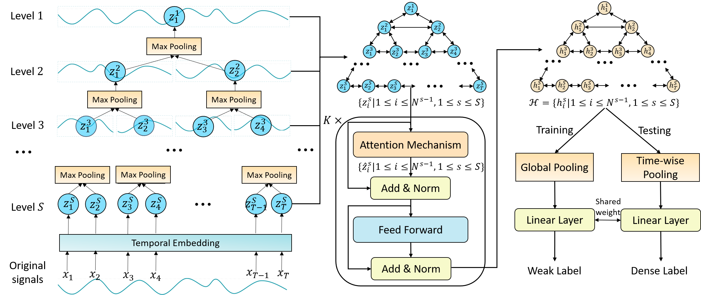
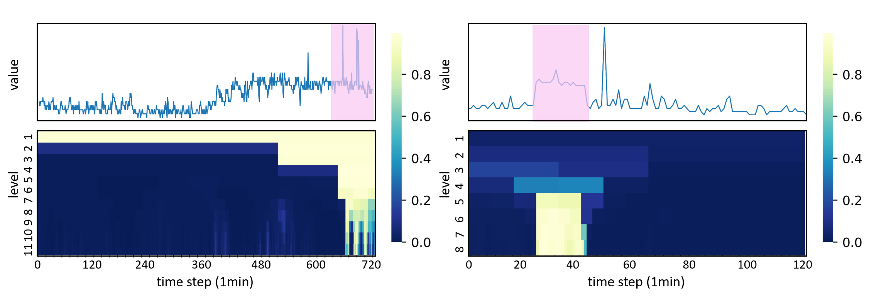

# TreeMIL 


<!-- - This is the code of ["Weakly Supervised Temporal Anomaly Segmentation with Dynamic Time Warping"] -->

## Overview

<p align="center">

<br>
	<em> Figure 2. The overall framework of TreeMIL. </em>
</p>

Our proposed framework, termed as **TreeMIL**, optimizes model by leveraging only weak supervision (i.e., instance-level anomaly labels, rather than point-level anomaly labels).
The framework is designed with three charaterisctis:

1) The entire time series is represented as a **N -ary tree**, where nodes represent subsequences of varying
lengths
2) The anomalous features of each node (subsequence) are generated using an **attention mechanism** that incorporates information from its parent node, children nodes, neighbor nodes and itsel
3) The anomaly discriminator considers anomaly features from **subsequences at various scales** when calculating point-level anomaly scores.

## Run the codes

#### STEP 1. Install the python libraries / packages

- numpy
- numba
- scikit-learn
- pytorch


#### STEP 2. Download the real-world datasets for temporal anomaly segmentation

- You can download the raw datasets from the following links.

  - EMG : http://archive.ics.uci.edu/ml/datasets/EMG+data+for+gestures
  - GECCO : https://bit.ly/3fOeRvI
  - SWAN-SF : https://bitbucket.org/gsudmlab/mvtsdata_toolkit/downloads/petdataset_01.zip%20
  - Credit Card : https://www.openml.org/d/1597
  - SMD : https://github.com/smallcowbaby/OmniAnomaly
  - PSM : https://github.com/eBay/RANSynCoders
  - SMAP : https://github.com/khundman/telemanom

- You need to split the whole temporal data into a training set, a validation set, and a test set.
- Then, place the files in the corresponding directories.
  - `./data/{DATASET}/train`, `./data/{DATASET}/valid`, and `./data/{DATASET}/test`
- We provide the preprocessed EMG dataset as an example.


#### STEP 3. Train and evaluate the TreeMIL framework

- You can simply run the code with the default setting, by using the following command.

```
python train.py
```

#### Anomaly scores map

<p align="center">

<br>
	<em> Figure 2. Both long and short collective anomalies can be captured by multi-scale nodes in the tree </em>
</p>


## Reference
1. 2021_ICCV_Weakly Supervised Temporal Anomaly Segmentation with Dynamic Time Warping
2. https://github.com/tsy935/eeg-gnn-ssl
3. https://github.com/thuml/Anomaly-Transformer

